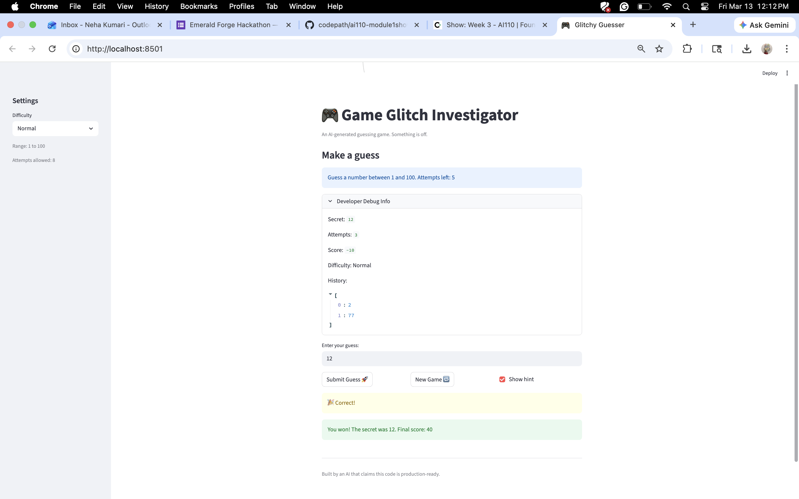

# 🎮 Game Glitch Investigator: The Impossible Guesser

## 🚨 The Situation

You asked an AI to build a simple "Number Guessing Game" using Streamlit.
It wrote the code, ran away, and now the game is unplayable. 

- You can't win.
- The hints lie to you.
- The secret number seems to have commitment issues.

## 🛠️ Setup

1. Install dependencies: `pip install -r requirements.txt`
2. Run the broken app: `python -m streamlit run app.py`

## 🕵️‍♂️ Your Mission

1. **Play the game.** Open the "Developer Debug Info" tab in the app to see the secret number. Try to win.
2. **Find the State Bug.** Why does the secret number change every time you click "Submit"? Ask ChatGPT: *"How do I keep a variable from resetting in Streamlit when I click a button?"*
3. **Fix the Logic.** The hints ("Higher/Lower") are wrong. Fix them.
4. **Refactor & Test.** - Move the logic into `logic_utils.py`.
   - Run `pytest` in your terminal.
   - Keep fixing until all tests pass!

## 📝 Document Your Experience

Game Glitch Investigator- The Glitchy Guesser is a logic-based number guessing game built with Streamlit. Players choose a difficulty level (Easy, Normal, or Hard) and attempt to find a secret random number within a specific range and attempt limit. The game tracks the user's history and awards a score based on how quickly they find the correct answer.

## 📸 Demo

## 🚀 Stretch Features
**Challenge 1:** Edge-Case Testing Steps
The 3 Edge Cases  handled:
Empty strings/Non-numeric input: Ensuring the game doesn't crash if a user clicks "Submit" without typing a number.
Decimals (Floats): Handling cases where a user types "50.5" instead of an integer.
Out-of-range values: Gracefully rejecting numbers like "-10" or "500" when the range is 1–100.

**Challenge 2:** Guess History Sidebar
- Displays all previous guesses in a live-updating sidebar table
- Shows guess number, value, and result (Too High/Too Low)
- Updates automatically as you play

**Challenge 3:** Advanced Game Logic & Testing
- Comprehensive unit tests for all game functions
- Edge-case validation and error handling
- All tests passing with pytest

**Challenge 4:** Enhanced Game UI
- 📊 **Dashboard Metrics**: Real-time display of Score, Attempts, and Difficulty
- 🔥 **Hot/Cold Indicator**: Emojis show proximity to secret number
  - 🔥 = Within 5 of the secret (hot)
  - ❄️ = Further away (cold)
- 📋 **Sidebar History Table**: Tracks all guesses with color-coded results
- 🎨 **Color-Coded Hints**: Success/warning boxes for visual feedback
- 🏆 **Wide Layout**: Enhanced UI with better spacing and readability

